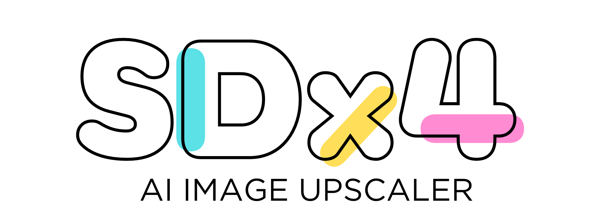
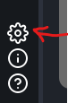
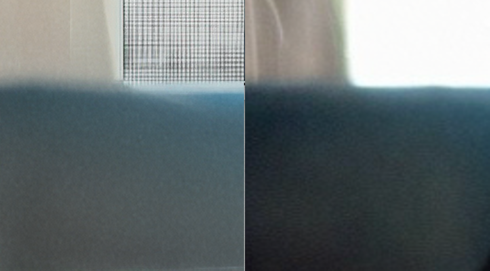
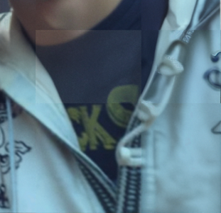
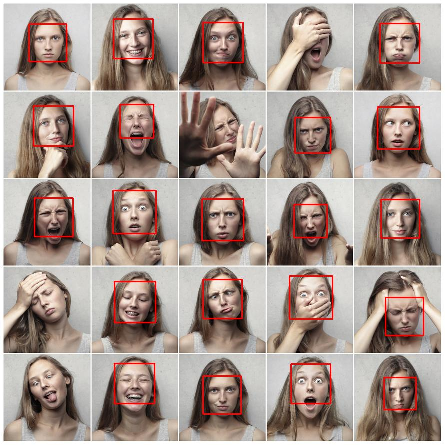
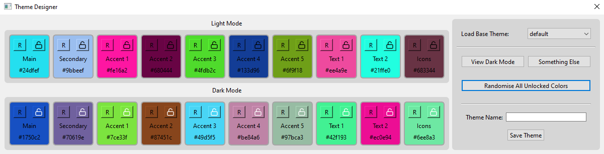

<div align="center">

# Windows SDx4 Image Upscaler v0.9.1 [BETA RELEASE]
### Author: Adill Al-Ashgar
#### Stability AI's Stable Diffusion x4 Upscaler in Locally Executable Windows GUI Package with advanced features.

 

      - 4x resoloution neural image upscaling
      - Local processing, no internet connection required, no data sent to any third party.
      - Advanced blended tiled processing for upscaling large images with low system memory.

[](https://www.python.org/)
[](https://github.com/Adillwma/SDx4_ImageUpscaler)
[](https://github.com/Adillwma/SDx4_ImageUpscaler/blob/main/LICENSE)

[](https://drive.google.com/file/d/1Cs3hMt9D-YJOe3HW44fJptYG9iyjL2F_/view?usp=sharing)

</div>

## Introduction
SDx4 Image Upscaler is a user-friendly native Windows program that leverages the power of the [Stable Diffusion x4 Upscaler](https://huggingface.co/stabilityai/stable-diffusion-x4-upscaler) model developed by [Stability AI](https://stability.ai/). This package is designed to provide a seamless, lightweight, and secure way to upscale your images with cutting edge neural upscaling. The package is bundled as a Windows installer, eliminating the need for Python or any additional code dependencies and includes smart tiled processing to massivly reduce the RAM/VRAM requirments for processing large images. Happy enhancing!

Windows Installer Download Link:  [SDx4 Download](https://drive.google.com/file/d/1Cs3hMt9D-YJOe3HW44fJptYG9iyjL2F_/view?usp=sharing)

## Table of Contents
- [Features](#main-features)
- [Installation](#installation)
   - [Windows](#windows-10)
   - [Other Operating Systems](#other-operating-systems)
- [Usage](#usage)
   - [Quick Start Guide](#quick-start-guide)
   - [Advanced Upscale Settings](#advanced-upscale-settings)
   - [Program Settings](#program-settings)
- [Methods](#methods)
   - [Tiled Processing](#tiled-processing)
   - [Dynamic Tileshifting](#dynamic-tileshifting)
   - [Feathered Patching](#feathered-patching-feature-coming-in-next-release)
- [Known Issues](#known-issues)
- [License](#license)
- [Contributions](#contributions)
- [Contact](#contact)
- [Donations](#donations)


## Main Features
- Packaged as a windows program with no dependencies or need to see code.
- Lightweight modern GUI. 
- Batch processing upscaling ability.
- Incorperates fixed tile processing to allow for large images to be upscaled with low ram usage whilst opperating the upscale model at its optimum input   resoloution.
- Local processing, no internet connection required, none of your data is sent to any third party.
- Customisable themes using the comprehensive integrated live theme designer.

### Behind the scenes (The sauce that makes the magic wheel spin)
- Incorperates fixed tile processing to allow for large images to be upscaled with low ram usage whilst opperating the upscale model at its optimum input resoloution (if set to 512). (Tile size selectable from 128, 256 or 512)
- Dynamic tileshifting to reduce image edge artifacts, and allow for a more accurate upscale whilst avoiding dark pixel padding or processing non image data.
- Edge blending methods selectable by user to reduce tile seams.  [COMING SOON]
- Haar Cascade face detection to allow for automatic increased processing quality on tiles containing faces.
- Live preview of the image upscale during processing, each tile is updated in the preview every other iteration.
- Ability to use the xFormers library to greatly speed up processing given a cuda gpu.            
- Ability to use cpu offloading to allow for boosted cpu processing whilst using a cuda gpu.   
- Ability to introduce attention slicing to reduce memory usage (not recomended, inferior to xFormers and covered by tiled processing) 

## Installation

### Windows 10 +
To install SDx4 for Windows, follow these steps:

1. Download the latest release of Windows_SDx4.exe from this repo using the following link: [SDx4 Download](https://drive.google.com/file/d/1Cs3hMt9D-YJOe3HW44fJptYG9iyjL2F_/view?usp=sharing)

2. Run the downloaded 'SDx4 Image Upscaler.exe' file and follow the on screen instructions to install the program.

3. Once installed you can run the program from the start menu or desktop shortcut.

4. Enjoy your upscaled images! (For tips or help using the program see the [Usage](#usage) section below)

### Other Operating Systems
SDx4 is primarily developed for Windows. However, it can also be run on other operating systems by executing the Python code directly. 
To run SDx4 Image Upscaler on other operating systems, follow these steps:

1. Clone this repo to your local machine using `git clone`:

```shell
git clone
```

2. Install the required dependencies using `pip`:

```shell
pip install -r requirements.txt
```

3. Run the application using `python`:

```shell
python SDx4_Image_Upscaler.py
```

### Headless Class 
Additionally the SDx4Upscaler is availble without gui as a python class for use in your own projects. This can be installed via pip using the following command:

```shell
pip install SDx4UpscalerClass
```

And then imported into your project using:

```python
from SDx4UpscalerClass import SDx4UpscalerClass
```

More information on the headless class can be found in PyPi page [SDx4UpscalerClass on Pypi](   )  or standalone github repo [SDx4UpscalarClass on Github]().

## Usage

### Quick Start Guide:
To run SDx4 Image Upscaler, follow these steps:

1. Add the image(s) you wish to upscale by clicking the 'Add Images' button or add all the images in a folder at once by clicking the 'Add folder' button.

2. Select the output directory you wish to save the upscaled image to on the right hand settings pane.

3. Click the 'Upscale' button to begin upscaling...

4. ... Congratulations your image(s) are now 4x the resoloution!

<div align="center">

 

</div>

### Advanced Upscale Settings:

For more settings you can click the 'Advanced Mode' button to open the full upscale settings panel.

#### Iterations
- Select the desired number of iterations using the slider. The higher the number of iterations the longer it will take to process each image, usually the more iterations used the better the upscale will be. Default is 50 iterations.

#### Boost Face Quality
- Enabling the "Boost Face Quality" will attempt to automatically detect faces in the image and process tiles that contain faces with 2x the set number of iterations. The upscaling struggles the most with reproducing human faces, so this can be used to improve the quality of faces in the final image. This will increase the processing time of the image. This feature can either be used to provide increased face quality above the rest of the image, or to reduce processing time by reducing the number of iterations used for the rest of the image whilst retaining acceptable face reproduction, these have both been quantified later in the readme in the [Boosted Face Quality](#boosted-face-quality) section.

#### Guidance Scale
- Set the Guidance Scale value. This controll how much the upscale is affected by the text prompt and negative prompt. Setting to 0 gives no effect from the prompts and the cleanest upscale in our opinion! Although your own results may vary. 

#### Text Prompt
- If you set the guidance scale > 0 you can enter a text prompt to guide the upscale. This can be anything you like, but we recomend a short description of the image. For example if you are upscaling a picture of a cat you could enter 'A picture of a cat'. This will help the upscale to focus on the cat and not the background.

#### Negative Text Prompt
- Similarly you can enter a negative prompt to guide the upscale away from certain things. For example you can enter tems like 'text' or 'noise' to gently guide the upscale away from certain things, with varyiing degrees of succcess. 

#### Tile Edge Blending
- Enable or disable tile edge blanding by clicking the 'Enable Tile Edge Blending' button. (Can be changed after upscale???)

- If tile edge blending is enabled, select the desired blend mode from the drop down menu.

#### Pipeline Settings
- Configure the pipeline settings, optional but can be used to speed up processing and reduce memory usage. These enhancements are exclusively available for NVIDIA CUDA 11.1+ enabled GPUs, if a supported GPU is not detected the settings will not be applied.
  - ⚠️ Attention slicing: When memory efficient attention and sliced attention are both enabled, memory efficient attention takes precedent. This enhancement is exclusively available for NVIDIA CUDA 11.1+ enabled GPUs and the program will automatically disable this setting if enabled without a supported GPU.
  - ⚠️ CPU offloading: This enhancement is exclusively available for NVIDIA CUDA 11.1+ enabled GPUs and the program will automatically disable this setting if enabled without a supported GPU.
  - ⚠️ xFormers memeory efficent attentiton: This enhancement is exclusively available for NVIDIA CUDA 11.1+ enabled GPUs and the program will automatically disable this setting if enabled without a supported GPU.

### Program Settings:

To access the main program settings window, click the settings cog located at the bottom left of the UI.

<div align="center">

 

</div>

This will open the settings window where you can configure the following settings:

- Set the program theme from list of availible themes.

- Open the integrated Theme Designer to create your own custom theme with live preview on the UI.

- Check for porgram updates, and download and install them if availible.

## Methods

### Tiled Processing
Previous implementations of the Stable Diffusion x4 Upscaler I have found have all been wonderfull however are limited by the amount of memory (RAM or VRAM depending on compute device) available on the system. To upscale very large images the memory usage can become extreamaly high, and in some cases exceed the available memory on the system, particuallrly when run on a consumer platform with low system memory. To overcome this limitation i have implemented 'tiled processing'. Tiled processing involves splitting the image into tiles of a smaller size, upscaling each tile individually and then recombining them for the final output. This allows for the upscaling of very large images with low memory usage, although does come with the downside of increased processing time.

We use a fixed tile size which is user selectable between 128, 256, 512 and 1024 pixels. Smaller tile sizes will use less memory but will increase processing time. Proper testing to determine the optimal tile size has not been conducted yet, however the stable diffusion upscale model was trained on 512x512 images so it is likely that 512 is the optimal tile size in terms of output quality. 

(NOTE: For input images that are smaller than the selected tile size the processor will abandon a tiled approach and process the image as a whole in one pass.)

Fixed size tiled processing neccesitates padding edges of any input images that have dimensions not divisible by the tile size. This amounts to adding a bunch of new 0 value pixels that need to be processed yet have no use. Additonally this method can introduce strange image artifacts in those tiles at the edges that have padding in them, due to the kernel taking into account the black padding, as can be seen in the following example:

<div align="center">

 

The same tile shown using padding method of tiling (left) compared to my tileshifted method (right). 

</div>

### Dynamic Tileshifting
To overcome the issues with a simple tiling strategy descrived above, SDx4 is built round a method of dynamic tileshifting where a number of tiles are selected to cover the image as before, taking into account the padding size, however with the tiles bounded to the image, and the padding dynamically calculated for each tile based on a minimum target overlap set by user.

Every tile therfore is filled with image data, solving the distortion due to tiles full of padding on the right and bottom edge of the image.

This does mean we are processing pixels of the image multiple times for no reason but it is favorable to it being padding which distorts the output and there si no way to scape it and retain the fixed window size for the model.

### Feathered Patching [FEATURE COMING IN NEXT RELEASE]
Currently the implementation of tiles processing can cause visible seams between tiles, as shown in the following example: 

<div align="center">

 
</div>

To overcome this a new method of feathered patching where the tiles are blended together at the edges to reduce the visibility of the seams which will be a part of the next update. This is done by blending the edges of the tiles with the edges of the adjacent tiles. The blending is done using a user selectable blending mode,

-Additive
-Subtractive
-Multiply
-Divide
-Overlay
-Soft Light
-Hard Light
-Vivid Light
-Linear Light
-Pin Light

These allow the tiles to be blended together in a more natural way, and can be used to reduce the edge artifacts that can be seen in the standard hard edge blending method.

The aim is to be able to preview and adjust the blending live once upscaling has finished to perfect your image, although this may be further down the line with the setting having to be set before processing for now.


### Boosted Face Quality

Uses Haar Cascade face detection to check if faces are present in the image. This is conducted on the full image in case faces are larger than individual tiles and can not be detected by just checking the tiles. All tiles that contain part of the detected faces are processed with 2x the set number of iterations. This can be used to improve the quality of faces in the final image. This will increase the processing time of the image. This feature can either be used to provide increased face quality above the rest of the image, or to reduce processing time by reducing the number of iterations used for the rest of the image whilst retaining acceptable face reproduction. 

<div align="center">

 

In this example we can see that in all the images where the algorythm has failed to detect the face (other than the one where half the face is covered by the hand) the face is angled. In all the sucsessfull identifications the face is pretty straight on, this seems to be a limitation of the Haar Cascade model.  
Modified from Original Photo By: Andrea Piacquadio, from Pexels: https://www.pexels.com/photo/collage-photo-of-woman-3812743/

</div>
Haar cascades, introduced by Viola and Jones in 2001 paper "Rapid Object Detection using a Boosted Cascade of Simple Features", is one of the most popular object detection algorithm. Many algorithms have since surpassed Haar cascades accuracy (HOG + Linear SVM, SSDs, Faster R-CNN, YOLO etc.), but they are still relevant and useful today. One of the primary benefits of Haar cascades is that they are very fast. However, they tend to be prone to false-positive detections and are not as accurate as the more “modern” algorithms we have today. Work has begun to deploy additional face detection models, so far Google Mediapipe is incoperated and will be usable in the next working release.

# Additional GUI Features and information

## Theme Designer

<div align="center">

 

The integrated 'Theme Designer' dialog UI. 

</div>

#### Randomise single element
Each of the theme elements can be randomised individually by clicking the 'R' button on the square you wish to randomise. This will select a random colour for the element, and will not affect any other elements.

#### Lock
Each of the theme elements can be locked individually by clicking the 'Lock' button on the square you wish to lock. This will lock the colour of the element, preventing it from being randomised when the 'Randomise All Unlocked' button is pressed. 

#### Load Base Theme
Clicking the 'Load Base Theme' button will let you select a saved theme to use as a starting point, this will loose any changes you have made so make sure to save your theme first if you wish to keep it before loading.

#### Randomise All Unlocked
Clicking the 'Randomise All Unlocked' button will randomise all the unlocked theme elements, this will not affect any locked elements.

#### Save Theme
Before you click the button make sure to enter a unique name for your theme in the box. Clicking the 'Save Theme' button will let you save your theme. Once saved, the theme then will be availible to select in the main program theme selection dropdown alongside with the built in themes.

## Known Issues

- ~~GUI becomes non responsive while downloading the model from the huggingface server on first run.~~

   [Issue Tracking Link](https://github.com/Adillwma/AI_Image_Upscale_Windows_GUI/issues/1)

- ~~Program will use tiling even if image is smaller than a single tile.~~ 

   [Issue Tracking Link](https://github.com/Adillwma/AI_Image_Upscale_Windows_GUI/issues/2)   

- ~~Users can still navigate program when images are upscaling.~~ 

   [Issue Tracking Link](https://github.com/Adillwma/AI_Image_Upscale_Windows_GUI/issues/3) 

- ~~Upscale preview stays on first image if upscaling a number of images at once.~~ 

   [Issue Tracking Link](https://github.com/Adillwma/AI_Image_Upscale_Windows_GUI/issues/4) 

- ~~Model download repeatedly required, include download in installer rather than at runtime.~~

   [Issue Tracking Link](https://github.com/Adillwma/AI_Image_Upscale_Windows_GUI/issues/5) 

- ~~Add button hover effects to all buttons, so user is aware that program is still responsive.~~

   [Issue Tracking Link](https://github.com/Adillwma/AI_Image_Upscale_Windows_GUI/issues/6) 

- Better distinguish disabled buttons from enabled buttons.

   [Issue Tracking Link](https://github.com/Adillwma/AI_Image_Upscale_Windows_GUI/issues/7)

-  Move download update button to a popup window rather than always shown

   [Issue Tracking Link](https://github.com/Adillwma/AI_Image_Upscale_Windows_GUI/issues/8)

- Prevent preview image extending out of frame

   [Issue Tracking Link](https://github.com/Adillwma/AI_Image_Upscale_Windows_GUI/issues/9)

- Theme designer, randomise single colour not updating ui preview

   [Issue Tracking Link](https://github.com/Adillwma/AI_Image_Upscale_Windows_GUI/issues/10)

- Light theme needs finishing

   [Issue Tracking Link](https://github.com/Adillwma/AI_Image_Upscale_Windows_GUI/issues/11)

- Make default path for the add images and add image folder more sensible

   [Issue Tracking Link](https://github.com/Adillwma/AI_Image_Upscale_Windows_GUI/issues/12)

## License
This project is released under the GPL v3 license, [LICENSE](https://github.com/Adillwma/SDx4_ImageUpscaler/blob/main/LICENSE). This project also uses the following third-party libraries, please refer to the individual liscences for more information:

- [Stability AI Stable Diffusion x4 Upscaler](https://huggingface.co/stabilityai/stable-diffusion-x4-upscaler) License: [CreativeML Open RAIL++-M License](https://huggingface.co/stabilityai/stable-diffusion-2/blob/main/LICENSE-MODEL)

- [PyQt6](https://pypi.org/project/PyQt6/) License: [GNU 3](https://www.gnu.org/licenses/gpl-3.0.en.html)

- [MediaPipe library]() License: [Apache 2.0](https://github.com/google/mediapipe/blob/master/LICENSE)

- [diffusers](https://pypi.org/project/diffusers/) License: [Apache 2.0](https://github.com/huggingface/diffusers/blob/main/LICENSE)

- [requests](https://pypi.org/project/requests/) License: [Apache 2.0](https://github.com/psf/requests/blob/main/LICENSE)

- [opencv-python](https://pypi.org/project/opencv-python/) License: [Apache 2.0](https://github.com/opencv/opencv/blob/master/LICENSE)

- [torch](https://pypi.org/project/torch/) License: [Modified BSD](https://github.com/pytorch/pytorch/blob/master/LICENSE)

- [tqdm](https://pypi.org/project/tqdm/) License: [MIT License](https://github.com/tqdm/tqdm/blob/main/LICENCE)

- [numpy](https://pypi.org/project/numpy/) License: [Modified BSD](https://numpy.org/doc/stable/license.html)

- [matplotlib](https://pypi.org/project/matplotlib/) License: [PSF](https://github.com/matplotlib/matplotlib/blob/main/LICENSE/LICENSE)

- [Pillow](https://pypi.org/project/Pillow/) License: [HPND](https://github.com/python-pillow/Pillow/blob/main/LICENSE)


## Contributions
Contributions to this codebase are welcome! If you encounter any issues, bugs or have suggestions for improvements please open an issue or a pull request on the [GitHub repository](https://github.com/Adillwma/SDx4_ImageUpscaler).

## Contact
For any further inquiries or for assistance in running the simulation, please feel free to reach out to me at adill@neuralworkx.com.

## Donations
If you find this project useful, or implement it in your own work, please consider donating a coffee, the liquid that fuels this project and more!

<div align="center">

<a href="https://www.buymeacoffee.com/neuralworkx" target="_blank"></a>

</div>