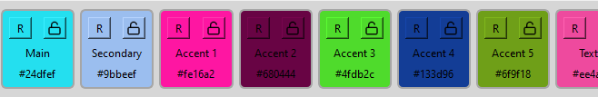

<div align="center">

# Windows SDx4 Image Upscaler
### Author: Adill Al-Ashgar
#### Stability AI's Stable Diffusion x4 Upscaler in Windows GUI Package with advanced features.

 

    - 4x resoloution neural image upscaling
    - No internet connection required, local processing, no data sent to any third party.
    - Advanced blended tiled processing for upscaling large images with low memory usage.

[](https://github.com/Adillwma/Windows_SDx4_ImageUpscaler)
[](https://www.python.org/)
</div>

## Introduction
SDx4 Image Upscaler is a user-friendly Windows GUI application that leverages the power of the  [Stability AI Stable Diffusion x4 Upscaler](https://huggingface.co/stabilityai/stable-diffusion-x4-upscaler) model. This package is designed to provide a seamless, lightweight, and secure way to upscale your images with cutting edge neural upscaling. The package is bundled as a Windows installer, eliminating the need for Python or any additional code dependencies. Happy enhancing!

## Table of Contents
- [Features](#features)
- [Installation](#installation)
   - [Windows](#windows)
   - [Other Operating Systems](#other-operating-systems)
- [Usage](#usage)
- [Methods](#methods)
   - [Tiled Processing](#tiled-processing)
   - [Dynamic Tileshifting](#dynamic-tileshifting)
   - [Feathered Patching](#feathered-patching)
- [Contributions](#contributions)
- [License](#license)
- [Contact](#contact)

# Features
- Packaged as a windows installer with no python or code dependencies.
- Lightweight modern windows GUI to simplify usage. 
- Batch processing upscaling ability.
- Incorperates fixed tile processing to allow for large images to be upscaled with low ram usage and direct cpu processig for users without cuda gpu's whilst opperating the upscale model at its optimum resoloution.
- Dynamic tileshifting to reduce image edge artifacts, and allow for a more accurate upscale whilst avoiding dark pixel padding or processing non image data.
- Edge blending methods selectable by user to reduce tile seams.
- Haar Cascade face detection to allow for automatic increased processing quality on tiles containing faces.
- Live preview of the image upscale during processing, each tile is updated in the preview every other iteration.
- Ability to use the xFormers library to greatly speed up processing given a cuda gpu.            
- Ability to use cpu offloading to allow for boosted cpu processing whilst using a cuda gpu.   
- Ability to introduce attention slicing to reduce memory usage (not recomended, inferior to xFormers and covered by tiled processing) 
- Local processing, no internet connection required.
- Data security, none of your data is sent to any third party.
- Customisable themes using the comprehensive integrated live theme designer.
- Automatic color pallette generation using the integrated live theme designer and multiple user selectable methods, i.e. monochromatic, complementary, analogous, split complementary, triadic, tetradic.


## Installation
SDx4 is primarily developed for Windows users, and we provide a pre-packaged executable for easy installation on Windows. However, it can also be run on other operating systems by executing the Python code directly. Additionally the SDx4Upscaler is availbe without gui as a python class for use in your own projects. This can be installed vai pip using the following command:

```shell
pip install SDx4Upscaler
```
   
### Windows
To install Windows_SDx4, follow these steps:

1. Download the latest release of Windows_SDx4.exe from this repo using the following link: [SDx4 Download](https://github.com/Adillwma/Windows_SDx4/raw/main/Windows_SDx4.exe)

2. Run the downloaded 'SDx4 Image Upscaler.exe' file.

### Other Operating Systems
To run SDx4 Image Upscaler on other operating systems, follow these steps:

1. Clone this repo to your local machine using `
git clone
`:

```shell
git clone
```

2. Install the required dependencies using `pip`:

```shell
pip install -r requirements.txt
```

3. Run the application using `python`:

```shell
python SDx4_Image_Upscaler.py
```

## Usage
To run SDx4 Image Upscaler, follow these steps:

      1. Add the image(s) you wish to upscale by clicking the 'Add Images' button or add all the images in a folder at once by clicking the 'Add folder' button.
         You can remove items added to the list by accident by selecting them on the list and clicking the 'Remove Selected' button

      2. Select the output directory you wish to save the upscaled image to on the right hand settings pane.

      3. Click the 'Upscale' button to begin upscaling...

      ... Congratulations your image is now 4x the resoloution!

Advanced Settings:

- Select the desired number of iterations using the slider. The higher the number of iterations the longer it will take to process each image, usually the more iterations used the better the upscale will be.

- Enabling the "Boost Face Quality" will attempt to automatically detect faces in the image and process tiles that contain faces with 2x the set number of iterations. The upscaling struggles the most with reproducing human faces, so this can be used to improve the quality of faces in the final image. This will increase the processing time of the image. This feature can either be used to provide increased face quality above the rest of the image, or to reduce processing time by reducing the number of iterations used for the rest of the image whilst retaining acceptable face reproduction, these have both been quantified later in the readme in the [Boosted Face Quality](#boosted-face-quality) section.

- Set the Guidance Scale value. This controll how much the upscale is affected by the text prompt and negative prompt. Setting to 0 gives no effect from the prompts and the cleanest upscale in our opinion! Although your own results may vary. 

- If you set the guidance scale > 0 you can enter a text prompt to guide the upscale. This can be anything you like, but we recomend a short description of the image. For example if you are upscaling a picture of a cat you could enter 'A picture of a cat'. This will help the upscale to focus on the cat and not the background.

- Similarly you can enter a negative prompt to guide the upscale away from certain things. For example you can enter tems like 'text' or 'noise' to gently guide the upscale away from certain things, with varyiing degrees of succcess. 

- Enable or disable tile edge blanding by clicking the 'Enable Tile Edge Blending' button. (Can be changed after upscale???)

- If tile edge blending is enabled, select the desired blend mode from the drop down menu.

- Configure the pipeline settings, optional but can be used to speed up processing and reduce memory usage. These enhancements are exclusively available for NVIDIA CUDA 11.1+ enabled GPUs, if a supported GPU is not detected the settings will not be applied.
  - ⚠️ Attention slicing: When memory efficient attention and sliced attention are both enabled, memory efficient attention takes precedent. This enhancement is exclusively available for NVIDIA CUDA 11.1+ enabled GPUs and the program will automatically disable this setting if enabled without a supported GPU.
  - ⚠️ CPU offloading: This enhancement is exclusively available for NVIDIA CUDA 11.1+ enabled GPUs and the program will automatically disable this setting if enabled without a supported GPU.
  - ⚠️ xFormers memeory efficent attentiton: This enhancement is exclusively available for NVIDIA CUDA 11.1+ enabled GPUs and the program will automatically disable this setting if enabled without a supported GPU.


## Methods

### Tiled Processing
To upscale very large images the memory usage can become extreamaly high, and in some cases exceed the available memory on the system, particuallrly when run on a consumer cpu with low system memory. To overcome this tiled processing is used. Tiled processing involves splitting the image into tiles of a smaller size, upscaling each tile individually and then recombining them for the final output. This allows for the upscaling of very large images with low memory usage and on bare CPU metal with no CUDA.

To get ideal image upscale it is best to stick to the input image size the model was trained on. To this end using a fixed tile size reagrless of the image is the way to ensure each upscale is as accurate as possible. 

to utilise the fixed size tiled processing will require padding edges of images which are not divisible by the tile size. This adds additional processing time as we are essentilly adding a buncvh of new pixels that need to be processed and have no image data in them so we know they are worthless already. Additonally this imethod itroduces image artifacts in those tiles that have a large proportion of padding in them vs image content as can be seen in the following example:


<div align="center">

 

</div>


Additionally introdcuing tiling creates a new problem of edge artifacts. This is due to the fact that the model is trained on images that are not tiled, and thus the model has no knowledge of the edges of the tiles. This can be seen in the following example:


<div align="center">

 

</div>


To overcome this problem we developed a method of dynamic tileshifting. 


### Dynamic Tileshifting
To overcome the issues descrived with a simple tiling strategy we developed a method of dynamic tileshifting.

where a number of tiles are selected to cover the image as before, taking into account the padding size, however with the tiles bounded to the image, and the padding dynamically calulated with a minimum set by user.

Every tile therfore is filled with image data, solving the distortion due to tiles full of padding on the right and bottom edge of the image.

This does mean we are processing pixels of the image multiple times for no reason but it is favorable to it being padding which distorts the output and there si no way to scape it and retain the fixed window size for the model.

### Feathered Patching
In addition to the standard hard edge blanding various soft edge feathering blend modes for recombining the tiles are available to the user. These are:
-Additive
-Subtractive
-Multiply
-Divide
-Overlay
-Soft Light
-Hard Light
-Vivid Light
-Linear Light
-Pin Light

These allow the tiles to be blended together in a more natural way, and can be used to reduce the edge artifacts that can be seen in the standard hard edge blending method.
You can preview and adjust the blending live once upscaling has finished to perfect your image.


<div align="center">

 
</div>


### Boosted Face Quality

Uses Haar Cascade face detection to check if faces are present in the image. This is conducted on the full image in case faces are larger than individual tiles and can not be detected by just checking the tiles. All tiles that contain part of the detected faces are processed with 2x the set number of iterations. This can be used to improve the quality of faces in the final image. This will increase the processing time of the image. This feature can either be used to provide increased face quality above the rest of the image, or to reduce processing time by reducing the number of iterations used for the rest of the image whilst retaining acceptable face reproduction. 


<div align="center">

 
In this example we can see that in all the images where the algorythm has failed to detect the face (other than the one where half the face is covered by the hand) the face is angled. In all the sucsessfull identifications the face is pretty straight on, this seems to be a limitation of the Haar Cascade model. I have begun to deploy additional face detection models, so far google 


Modified from Original Photo By: Andrea Piacquadio, from Pexels: https://www.pexels.com/photo/collage-photo-of-woman-3812743/

</div>


# Additional GUI Features and information

## Theme Designer

<div align="center">

 
The integrated 'Theme Designer' dialog UI. 


</div>


### Randomising Color Palletes

#### Single Randomise


#### Randomise All Unlocked

- Palete selection method

Auto 
Monochromatic
Complementary
Analogous
Split Complementary
Triadic
Tetradic


- Locks
 
The integrated 'Theme Designer' dialog UI. 


</div>


## Contributions
Contributions to this codebase are welcome! If you encounter any issues, bugs or have suggestions for improvements please open an issue or a pull request on the [GitHub repository](https://github.com/Adillwma/BackupInspector).

## License
This project is not currently licensed. Please contact for more information.

This project also uses the following third-party libraries:

SDx4 Image Upscaler is built on top of the [Stability AI Stable Diffusion x4 Upscaler](https://huggingface.co/stabilityai/stable-diffusion-x4-upscaler) model developed by Robin Rombach and Patrick Esser. The model is licensed under the CreativeML Open RAIL++-M License. For more information, refer to the LISCENCE file.

Haar Cascade Face Detection: This project uses the Haar Cascade Face Detection model, released under the MIT License.

PyQt6: This project uses the PyQt6 library, released under the GPL v3.

NSIS


MediaPipe: This project uses the MediaPipe library, released under the Apache License 2.0.

#@title Licensed under the Apache License, Version 2.0 (the "License");
# you may not use this file except in compliance with the License.
# You may obtain a copy of the License at
#
# https://www.apache.org/licenses/LICENSE-2.0
#
# Unless required by applicable law or agreed to in writing, software
# distributed under the License is distributed on an "AS IS" BASIS,
# WITHOUT WARRANTIES OR CONDITIONS OF ANY KIND, either express or implied.
# See the License for the specific language governing permissions and
# limitations under the License.


# Contact
For any further inquiries or for assistance in running the simulation, please feel free to reach out to me at adill@neuralworkx.com.


